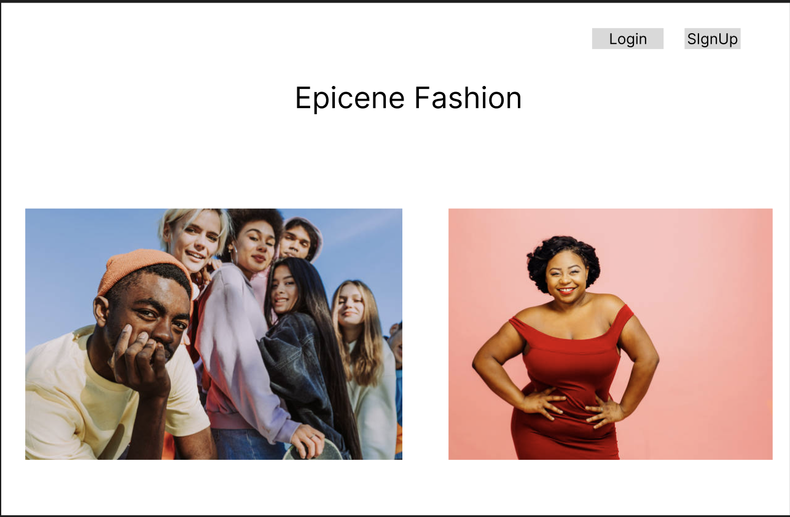
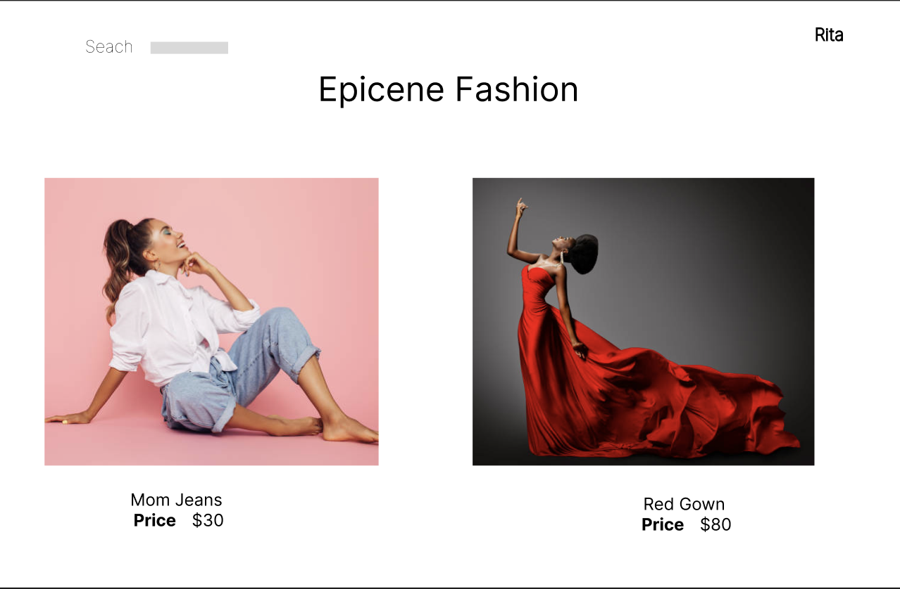
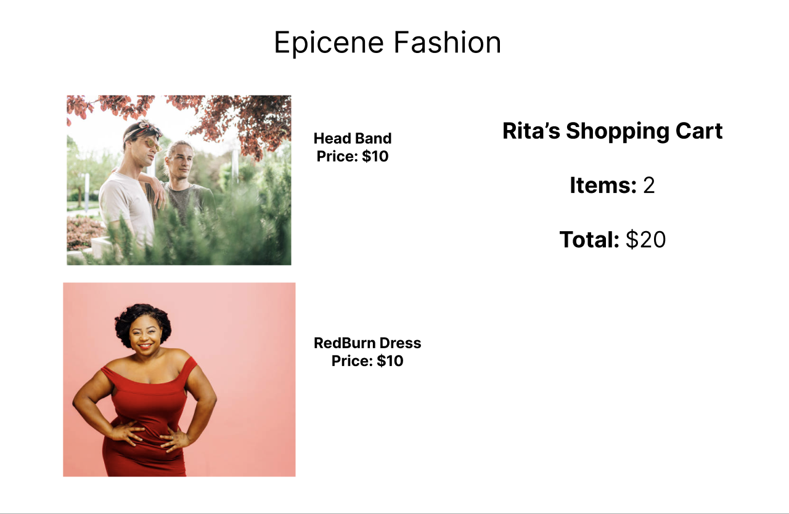
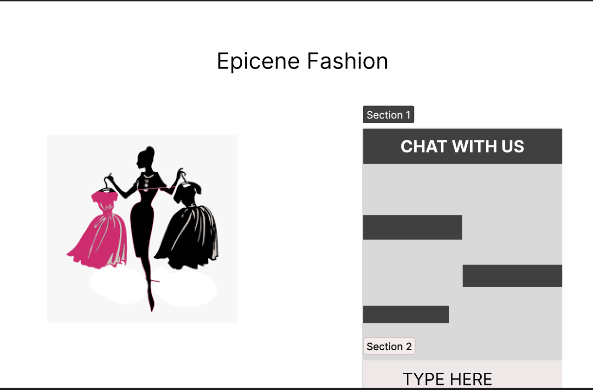

# Epicene Fashion
### Gender Neutral Clothing App


## User Story
 We are a gender neutral clothing line which aims to provide clothing for all curves of body and life. Our users can find a home page (landing page), where they can see our catalogue and view dresses. They can also filter the items depening on the style or colors.

 We provide our company details and website info at our home page to create reliability.

 Our users need to sign in to add items to add items to the cart, they can then select sizes and add the item to the cart. We tend to provide a downloading option for deownloading their payment receipt. Past orders can also be accessed by the users in their order history.

 Functionality:

 - User
    -`Signup`, `Login`, `Logout`
    - `Search Functionality` by `style` or `color`

 - Place Order
    - `Select size`
    - `Add to Cart` and `order total`
    - `Make payment`
    - `View previous orders`
   

 - Payment Gateway
	- `Stripe API`
	- `Download E-receipt`
		- `AWS S3`

 - Footer Links
    - `Scan qr code`
    - `Location on google maps`
    - `Contact Details`
    -  Vision / Motive

 - Bonus
	- `Wishlist for our customers`
    - `ChatBot`

	

# Technologies Used

1. Java Script
2. Express.js
3. Node.js
4. Npm and its packages
    - `bcrypt`
    - `Socket.io`
    - `Cors`
	- `Kommunicate.io`
5. React.js
6. Stripe API (Payment Gateway) 
7. HTML/ CSS


# Wireframes

1. Home Page


2. Items Page


3. User Cart 


4. Payment Gateway


5. Stretch-goal: ChatBot



# Entity Relationship Diagram


# Models
1. User
```.js
const UserSchema = new Schema(
	{
		username: { 
			type: String, 
			required: true, 
			unique: true 
		},
		password: { 
			type: String, 
			required: true 
		},
		email: {
			type: String, 
			required: true 
		}
	},
	{ timestamps: true }
)
```

2. Item

```.js
const itemSchema = new Schema(
	{
		style: { 
			type: String, 
			required: true 
		},
		size: [
            String
        ],
		img:{
        	type: String
    	},
        price: {
			 type: Number,
			required: true 
		},
		title: { 
			type: String, 
			required: true 
		},
        color: { 
			type: String, 
			required: true 
		},
		
	},
	{ timestamps: true }
)

```


3. Cart

```.js


const cartSchema = new Schema ({

    products:[
        {type: Schema.Types.ObjectId,
        ref: 'Item'} 
    ],
    owner: {
        type: Schema.Types.ObjectId,
        ref: 'User',
        required: true
    },
    active: {
        type: Boolean,
        default: true
    }
    
},{
    timestamps: true,
    toObject: { virtuals: true },
    toJSON: { virtuals: true }
}
)

```
